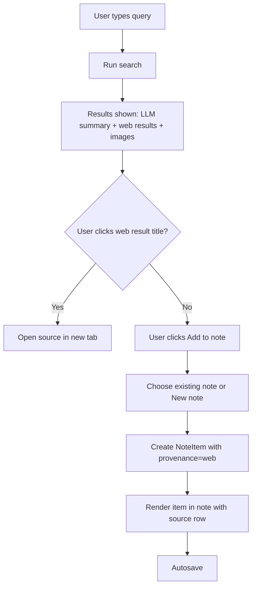
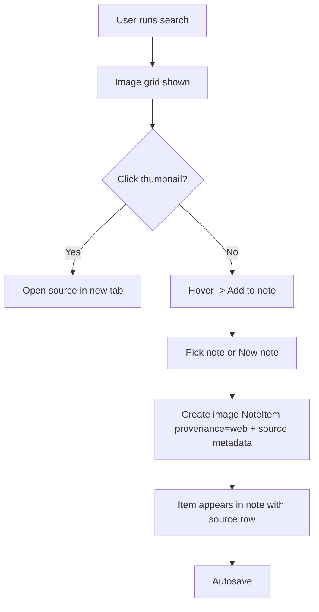
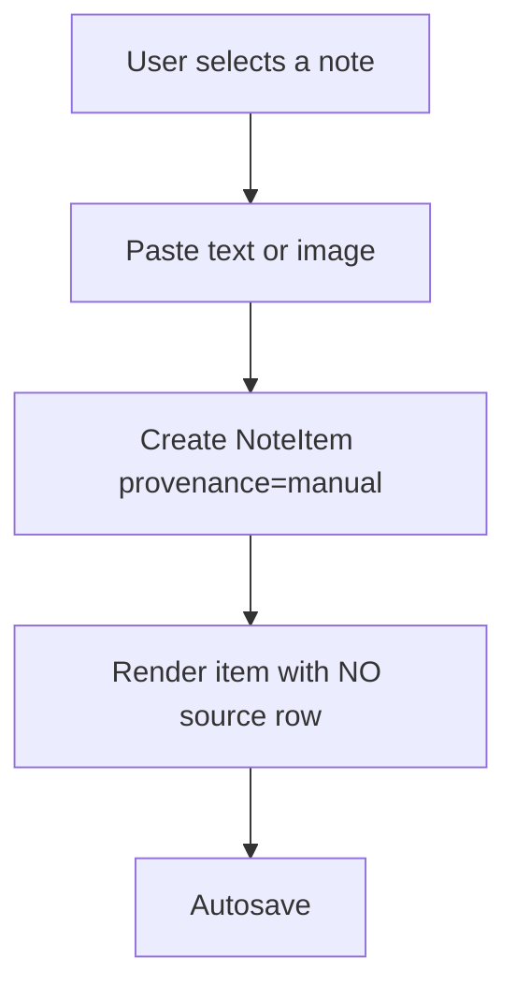
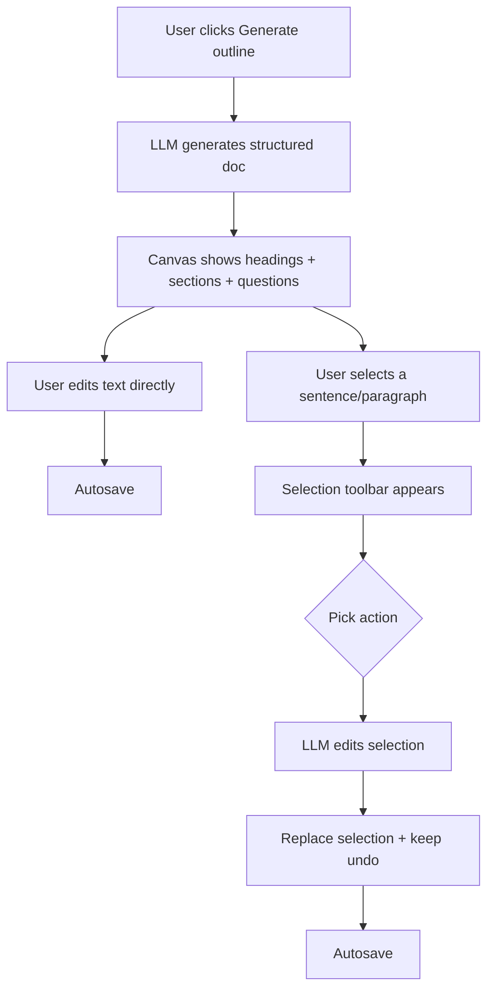
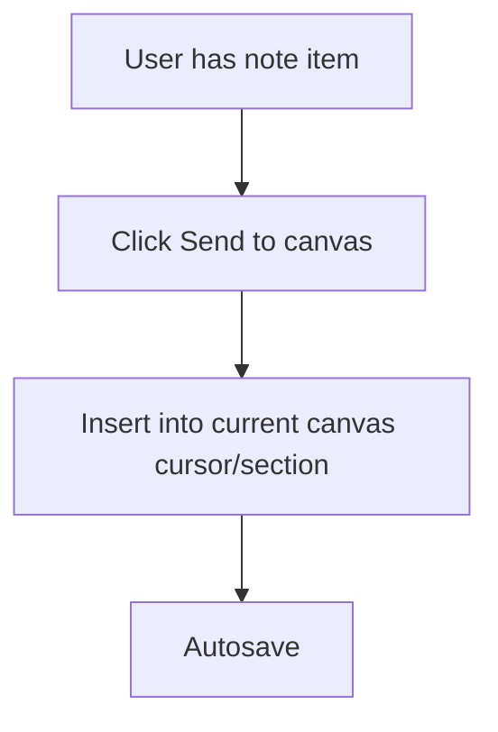

# Interview Prep Tab — v1 (wireframes, flows, state model)

This document complements `ui.md` with:
- Wireframe-level component list
- Key user flows (Search → clip → outline edit)
- Minimal UI state model for implementation

---

## 1) Wireframe-level component list

### 1.1 Global shell

**A. AppFrame**
- **TopBar**
  - TitleInlineEdit
  - SaveStatusIndicator
  - PrimaryActions
    - GenerateOutlineButton
    - ExportButton (optional v1)
    - HelpButton (optional v1)
- **ColumnsLayout**
  - LeftColumn (Notes)
  - ColumnDivider (resizable)
  - MiddleColumn (Search)
  - ColumnDivider (resizable)
  - RightColumn (Outline Canvas)

**B. ColumnDivider**
- Drag handle
- Double-click reset to 1:1:1 (optional)
- Cursor + hover affordance

---

### 1.2 Left column — Notes

**A. NotesPanel**
- HeaderRow
  - `+ New note` button
- NotesList (vertical)
  - NoteCard (bucket or pinned)

**B. NoteCard**
- NoteHeader
  - NoteTitleInlineEdit
  - DragHandle (reorder note)
  - NoteMenu (⋯)
    - Pin/Unpin (for bucket → pinned item note, optional v1)
    - DeleteNote
- NoteItemsList (vertical)
  - NoteItemCard

**C. NoteItemCard**
- ItemBody
  - TextBlock OR ImageBlock
- ItemSourceRow (shown only if provenance=web)
  - LinkIcon
  - Favicon
  - PageTitle (clickable)
  - Domain
  - Timestamp
- ItemActions
  - DragHandle (reorder within note)
  - DeleteItem
  - (Optional) CopyText (text items)
  - (Optional) OpenImageFull (image items)

**D. PasteIntoNote**
- NoteCard supports paste events:
  - Paste text → creates manual text item
  - Paste image (clipboard) → creates manual image item
- No source row for manual items

---

### 1.3 Middle column — Search

**A. SearchPanel**
- SearchInputRow
  - QueryInput
  - SearchButton
- SearchResultsArea
  - LLMSummaryCard (with citations)
  - WebResultsList
  - ImageResultsGrid
- (Optional v1) SearchHistoryDropdown

**B. LLMSummaryCard**
- SummaryText (with citation markers)
- CitationList
  - Each citation opens source in new tab
- (Optional) AddSummaryToNoteButton

**C. WebResultRow**
- TitleLink (opens in new tab)
- Snippet
- ResultMeta (domain, favicon, date if known)
- AddToNoteButton
  - NotePickerMenu
    - Existing notes
    - `Add to new note…`

**D. ImageResultsGrid**
- ImageThumbCard
  - Thumbnail
  - HoverActions
    - AddToNoteButton (note picker)
  - Click behavior:
    - Click thumbnail → open source in new tab

---

### 1.4 Right column — Outline Canvas

**A. CanvasPanel**
- CanvasHeader
  - (Optional) GenerateOutlineButton (duplicated for convenience)
- TableOfContents
  - SectionLink list (scroll-to)
  - Collapsible (optional)
- CanvasEditor (structured document)
  - HeadingBlock
  - ParagraphBlock
  - ListBlock
  - QuestionBlock (optional type)

**B. SelectionToolbar (floating)**
Appears on text selection:
- Improve
- Shorten
- Expand
- ChangeTone
- RewriteAsQuestions
- CustomPrompt…

**C. CanvasBlockMenu (optional v1)**
- Duplicate block
- Delete block
- Convert block type (paragraph ↔ list ↔ heading)

---

## 2) User flows

### 2.1 Search → clip → note (web result)

### 2.2 Search → clip → note (image result)

### 2.3 Manual paste into note (no URL)

### 2.4 Generate outline → edit → refine selected text

### 2.5 Add research into outline (optional v1 bridging action)
If you want a bridge action on NoteItemCard (optional):
- `Send to canvas` → inserts as a bullet or paragraph under selected section.

---

## 3) Minimal UI state model (objects/fields)

This is intentionally small and practical for an MVP.

### 3.1 Domain entities

#### Interview
- `id: string`
- `title: string`
- `createdAt: string (ISO)`
- `updatedAt: string (ISO)`

#### Note
- `id: string`
- `interviewId: string`
- `title: string`
- `orderIndex: number`
- `type: "bucket" | "pinned"`
- `createdAt: string (ISO)`
- `updatedAt: string (ISO)`

#### NoteItem
- `id: string`
- `noteId: string`
- `orderIndex: number`
- `type: "text" | "image"`
- `provenance: "web" | "manual"`
- `text?: string` (for text items)
- `image?: {`
  - `src: string` (could be blob URL, CDN URL, or storage key)
  - `alt?: string`
  - `width?: number`
  - `height?: number`
  - `mimeType?: string`
  - `}`
- `source?: {` (only when provenance="web")
  - `url: string`
  - `title?: string`
  - `domain?: string`
  - `faviconUrl?: string`
  - `capturedAt: string (ISO)`
  - `}`
- `createdAt: string (ISO)`
- `updatedAt: string (ISO)`

#### CanvasDoc
- `interviewId: string`
- `content: CanvasBlock[]`
- `updatedAt: string (ISO)`

#### CanvasBlock (simple block model)
- `id: string`
- `type: "heading" | "paragraph" | "list"`
- `level?: number` (for heading 1..4)
- `text?: string` (paragraph/heading)
- `items?: string[]` (for list)
- `collapsed?: boolean` (for headings, optional)
- `meta?: {`
  - `origin?: "llm" | "user"`
  - `}`

### 3.2 Search state

#### SearchSession
- `query: string`
- `status: "idle" | "loading" | "ready" | "error"`
- `error?: string`
- `results: SearchResults`

#### SearchResults
- `llmSummary?: {`
  - `text: string`
  - `citations: Citation[]`
  - `}`
- `web: WebResult[]`
- `images: ImageResult[]`

#### Citation
- `id: string`
- `url: string`
- `title?: string`
- `domain?: string`

#### WebResult
- `id: string`
- `url: string`
- `title: string`
- `snippet?: string`
- `domain?: string`
- `faviconUrl?: string`
- `publishedAt?: string (ISO)` (if available)

#### ImageResult
- `id: string`
- `thumbUrl: string`
- `imageUrl?: string` (full)
- `sourcePageUrl: string`
- `title?: string`
- `domain?: string`
- `faviconUrl?: string`

### 3.3 UI layout and interaction state

#### LayoutState
- `columns: {`
  - `leftWidthPct: number`
  - `middleWidthPct: number`
  - `rightWidthPct: number`
  - `}`

Default: 33.33 / 33.33 / 33.33.

#### SelectionState (canvas)
- `selectedRange?: {`
  - `blockId: string`
  - `start: number`
  - `end: number`
  - `}`
- `toolbarVisible: boolean`

#### SaveState
- `status: "saved" | "saving" | "error"`
- `lastSavedAt?: string (ISO)`
- `error?: string`

---

## 4) Implementation notes (minimal)

- **Autosave**
  - Debounce edits (e.g., 500–1500ms)
  - Save notes and canvas independently, but show a single global status.
- **Open in new tab**
  - Search results and citation clicks use standard anchor behavior.
- **Clipboard paste**
  - NotesPanel captures paste events when a note is focused/selected.
- **Resizing**
  - Store column widths in LayoutState and persist per user (optional).

